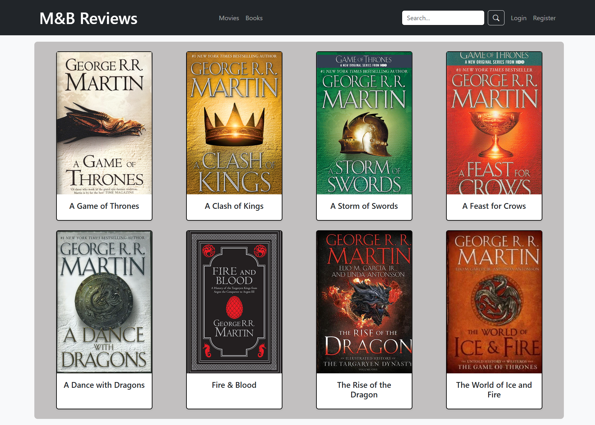
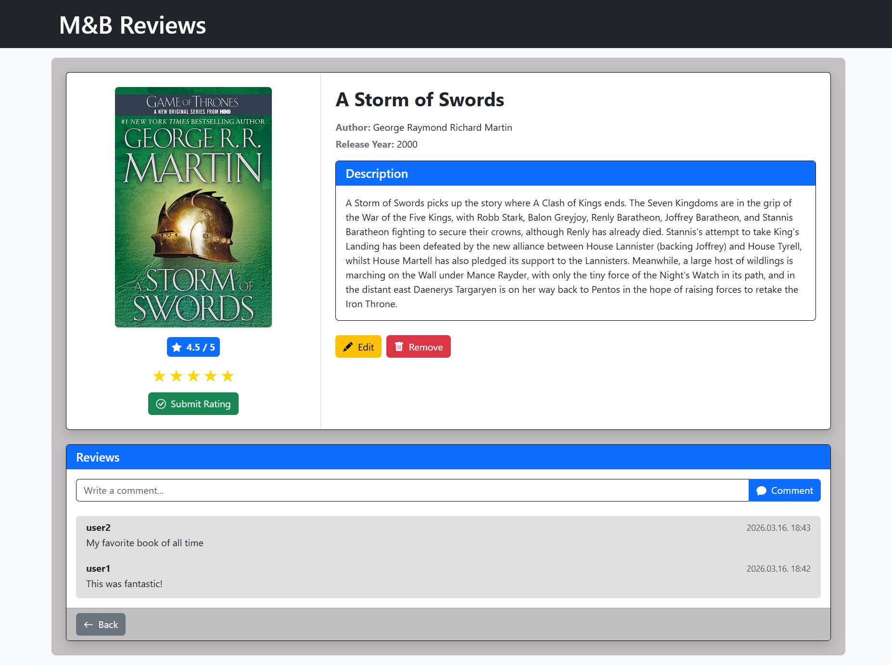
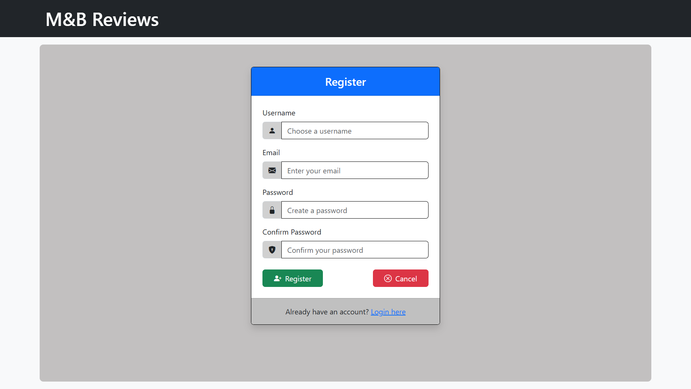
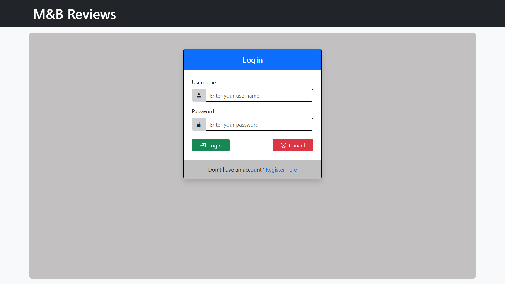

<div align="center">
   <h1>🎬📚 Movie & Book Review Web App</h1>

  
  
  
  
</div>

<div align="center">
  <h3>The ultimate platform where film fanatics and bookworms unite!</h3>
</div>

---

## 🖼️ Screenshots

<p align="center">
  
</p>

<p align="center">
  
</p>

<p align="center">
  
</p>

<p align="center">
  
</p>

---

## 📋 Overview

**M&B Reviews** is a full-featured web application that allows users to discover, review, and discuss their favorite
movies and books. Built with Node.js and MongoDB, this platform offers a seamless experience for entertainment
enthusiasts to share their opinions and explore new content.

---

## ✨ Key Features

- **📚 Comprehensive Media Library**: Browse, search, and filter through an extensive collection of movies and books
- **⭐ Rating System**: Rate items on a 5-star scale and see community average ratings
- **💬 Interactive Comments**: Engage in discussions with other users through the commenting system
- **🔍 Powerful Search**: Find exactly what you're looking for with intuitive search functionality
- **👤 User Accounts**: Register, login, and interact
- **🔒 Secure Authentication**: Protected routes ensure only authorized users can perform certain actions
- **🖼️ Media Upload**: Add cover images to enhance visual appeal
- **🛠️ CRUD Operations**: Full create, read, update, and delete functionality for all content

---

## 🧠 Technology Stack

| Component       | Technology                       |
|-----------------|----------------------------------|
| **Backend**     | Node.js, Express.js              |
| **Frontend**    | EJS templates, CSS and Bootstrap |
| **Database**    | MongoDB with Mongoose ODM        |
| **Auth**        | Express-session                  |
| **File Upload** | Multer                           |
| **Testing**     | Jest                             |
| **Development** | Nodemon                          |

---

## 🚀 Getting Started

### Prerequisites

- Node.js (v14 or higher)
- npm (v6 or higher)
- MongoDB (v4 or higher)

### Installation

1. **Clone the repository**
   ```bash
   git clone https://github.com/torozsom/MnB-ReviewSite.git
   cd MnB-ReviewSite
   ```

2. **Install dependencies**
   ```bash
   npm install
   ```

3. **Configure environment**
    - Make sure MongoDB is running on your local machine
    - Create a `.env` file in the root directory (optional for custom configuration)

4. **Start the application**
   ```bash
   node index.js
   # or if you have nodemon installed
   nodemon index.js
   ```

5. **Access the application**
    - Open your browser and navigate to: http://localhost:3000

---

## 🧪 Running Tests

To run the automated tests for the application:

```bash
npm test
```

This will execute the Jest test suite located in the `tests/` directory.

---

## 🧭 Usage Guide

### For Visitors

- Browse the homepage to see featured movies and books
- Use the search functionality to find specific titles
- View details, ratings, and comments for any item
- Register for an account to unlock additional features

### For Registered Users

- Rate movies and books on a 5-star scale
- Leave comments and engage in discussions
- Add new movies and books to the database
- Edit or delete items

---

## 📁 Project Structure

```
MnB_ReviewSite/
├── config/           # Database configuration
├── middlewares/      # Express middlewares
├── models/           # Mongoose models
├── public/           # Static assets (CSS, images)
├── routing/          # Route definitions
├── tests/            # Unit and integration tests
├── views/            # EJS templates
└── index.js          # Application entry point
```
